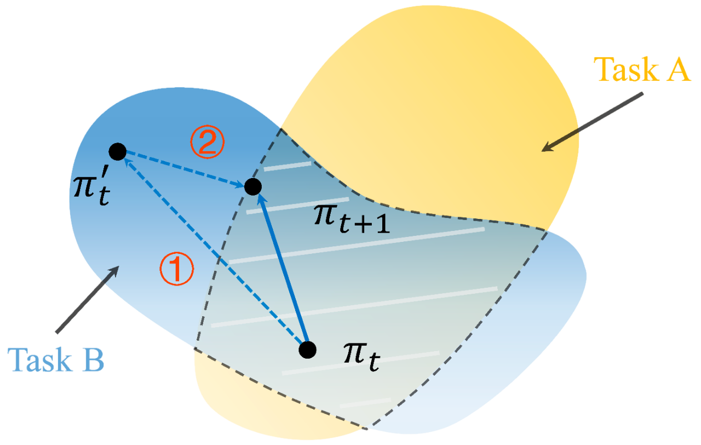

<div align="center">
  

# PiCor: Multi-task Deep Reinforcement Learning with Policy Correction

<p align="center" style="border-bottom: 2px solid #000; width: 100%; margin: 0 auto;"></p>

  [](https://aaai.org/conference/aaai/aaai-2023) [](LICENSE) [](https://www.python.org/)

</div>

## Overview

<div align="center">
  
</div>

PiCor is an efficient multi-task Deep Reinforcement Learning framework that introduces a novel two-phase learning paradigm: **Policy Optimization** and **Policy Correction**.

**Phase 1 - Policy Optimization**:

- Samples tasks from the task distribution
- Performs policy learning with task-specific experience replay
- Compatible with any DRL algorithm (SAC, PPO, TD3, etc.)

**Phase 2 - Policy Correction**:

- Constructs a performance constraint set considering all tasks
- Ensures policies remain within the performance improvement region
- Controls negative gradient interference between tasks

## Quick Start

### Prerequisites

- **Python**: 3.9+
- **CUDA**: 11.3+ (for GPU support)
- **OS**: Linux, macOS, Windows

### Installation

Install system dependencies (Ubuntu/Debian only)

```bash
# Clone and install
git clone git@github.com:ChangWinde/PiCor.git
cd PiCor

chmod +x scripts/install_apt.sh
sudo ./scripts/install_apt.sh
```

Get started with PiCor in under 2 minutes:

```bash
# Install Python environment
chmod +x scripts/install.sh
./scripts/install.sh
```

If you are not using `uv`, you can install PiCor with `requirements.txt`:

```bash
conda create -n picor python=3.9
conda activate picor

pip install -r requirements.txt
```

## Usage

### Quick Training

Start training immediately with our pre-configured environments:

```bash
cd source

# MetaWorld MT10 - Robotic manipulation tasks
uv run python main.py --experiment PiCor --env_name metaworld_mt10 --seed 0

# HalfCheetah MT8 - Locomotion tasks  
uv run python main.py --experiment PiCor --env_name halfcheetah_mt8 --seed 0
```

### Advanced Configuration

Customize training for your specific needs:

```bash
# High-performance training with custom parameters
uv run python main.py \
    --experiment PiCor \
    --env_name metaworld_mt10 \
    --seed 42 \
    --num_train_steps 1000000 \
    --device 0 \
    --wandb
```

### Configuration Parameters

| Parameter             | Description                     | Default            | Example             |
| --------------------- | ------------------------------- | ------------------ | ------------------- |
| `--experiment`      | Experiment name for logging     | `picor`          | `my_experiment`   |
| `--env_name`        | Environment to train on         | `metaworld_mt10` | `halfcheetah_mt8` |
| `--seed`            | Random seed for reproducibility | `42`             | `123`             |
| `--num_train_steps` | Total training steps            | `500000`         | `1000000`         |
| `--device`          | GPU device ID                   | `0`              | `1`               |
| `--wandb`           | Enable Weights & Biases logging | `False`          | `True`            |

## Monitoring  Experiment

Monitor your training progress in real-time with [Weights &amp; Biases](https://wandb.ai/):

```bash
# Set up your environment variables, create a file '.env' with following content
export WANDB_API_KEY="your_api_key"
export WANDB_PROJECT="picor"
export WANDB_ENTITY="your_username"

# Start training with logging
uv run python main.py --experiment PiCor --env_name metaworld_mt10 --wandb
```

## Development

### Code Quality

Maintain high code standards with our quality tools:

```bash
# Quick check (recommended)
./scripts/code_quality.sh

# Check only (no file modifications)
./scripts/code_quality.sh --check

# Individual tools
uv run flake8 source/          # Style and error checking
uv run black source/ --line-length=100 --check  # Code formatting check
python scripts/check_imports.py                 # Custom import style check
uv run mypy source/            # Type checking
```

## Citation

If you find PiCor useful in your research, please cite our paper:

```bibtex
@inproceedings{bai2023picor,
  title={PiCor: Multi-task deep reinforcement learning with policy correction},
  author={Bai, Fengshuo and Zhang, Hongming and Tao, Tianyang and Wu, Zhiheng and Wang, Yanna and Xu, Bo},
  booktitle={Proceedings of the AAAI Conference on Artificial Intelligence},
  volume={37},
  number={6},
  pages={6728--6736},
  year={2023}
}
```

## 🙏 Acknowledgments

We thank the following projects and communities:

- 🦾 **[MetaWorld](https://github.com/rlworkgroup/metaworld)** - Robotic manipulation environments
- 📊 **[Weights &amp; Biases](https://wandb.ai/)** - Experiment tracking and visualization

---

<div align="center">
  <p>Made with by Fengshuo Bai</p>
  <p>⭐ Star this repository if you find it helpful!</p>
</div>
